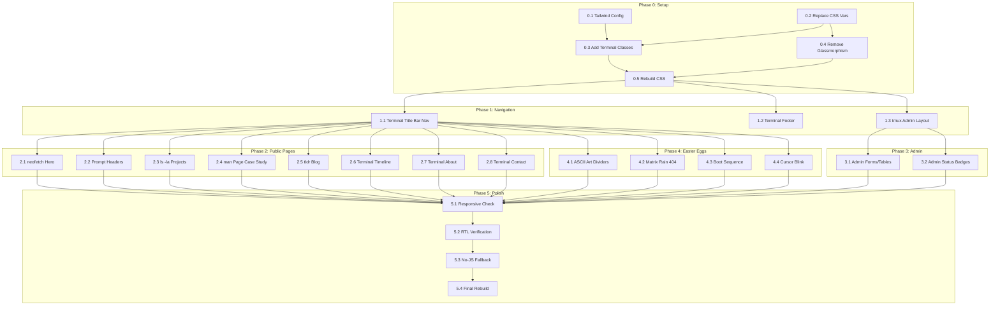

# Tasks: Terminal Geek Theme

## Task Plan

### Phase 0: Setup & CSS Foundation

| ID | Task | File(s) | Dependencies | Parallel |
|----|------|---------|--------------|----------|
| 0.1 | Extend Tailwind config with Catppuccin Mocha colors | tailwind.config.js | — | [P] |
| 0.2 | Replace CSS variables with Catppuccin Mocha palette | public/assets/css/input.css | — | [P] |
| 0.3 | Add terminal CSS classes (term-panel, term-border, term-prompt, term-cursor, term-boot, term-progress, term-neofetch, term-man-header, term-status-active, term-status-inactive) | public/assets/css/input.css | 0.2 | |
| 0.4 | Remove glassmorphism CSS classes (glass, glass-card, gradient-text, gradient-border, hex-bg, scan-line) | public/assets/css/input.css | 0.2 | |
| 0.5 | Rebuild CSS | npm run build:css | 0.3, 0.4 | |

### Phase 1: Navigation & Layout

| ID | Task | File(s) | Dependencies | Parallel |
|----|------|---------|--------------|----------|
| 1.1 | Restyle public navigation as terminal title bar | templates/layouts/public.php, templates/components/header.php | 0.5 | |
| 1.2 | Add terminal-styled footer with LICENSE block and uptime badge | templates/components/footer.php | 0.5 | |
| 1.3 | Restyle admin dashboard as tmux multiplexer layout | templates/layouts/admin.php | 0.5 | |

### Phase 2: Public Page Templates

| ID | Task | File(s) | Dependencies | Parallel |
|----|------|---------|--------------|----------|
| 2.1 | Convert hero section to neofetch-style output | templates/components/hero.php, templates/pages/home.php | 0.5 | [P] |
| 2.2 | Add prompt prefix headers to homepage sections | templates/pages/home.php | 0.5 | [P] |
| 2.3 | Restyle projects page as ls -la listing with systemd badges | templates/pages/projects.php, templates/components/project-card.php | 0.5 | [P] |
| 2.4 | Convert project detail to man page format | templates/pages/project-detail.php | 0.5 | [P] |
| 2.5 | Restyle blog pages as tldr entries | templates/pages/blog.php, templates/pages/blog-post.php, templates/components/blog-card.php | 0.5 | [P] |
| 2.6 | Restyle timeline as terminal-styled entries | templates/components/timeline-item.php | 0.5 | [P] |
| 2.7 | Restyle about page with terminal output formatting | templates/pages/about.php | 0.5 | [P] |
| 2.8 | Restyle contact page with terminal-styled form | templates/pages/contact.php | 0.5 | [P] |

### Phase 3: Admin Template Styling

| ID | Task | File(s) | Dependencies | Parallel |
|----|------|---------|--------------|----------|
| 3.1 | Apply terminal styles to all admin form elements, tables, and panels | templates/admin/*.php | 0.5 | [P] |
| 3.2 | Add systemd status badges to project cards and messages in admin | templates/admin/*.php | 0.5 | [P] |

### Phase 4: Easter Eggs & Animations

| ID | Task | File(s) | Dependencies | Parallel |
|----|------|---------|--------------|----------|
| 4.1 | Add ASCII art section dividers to homepage | public/assets/css/input.css, templates/pages/home.php | 0.5 | [P] |
| 4.2 | Add Matrix rain canvas animation to 404 page | templates/pages/404.php, public/assets/js/app.js | 0.5 | [P] |
| 4.3 | Add boot sequence animation to initial homepage load | public/assets/css/input.css, public/assets/js/app.js | 0.5 | [P] |
| 4.4 | Add terminal cursor blink animation to prompt line | public/assets/css/input.css | 0.5 | [P] |

### Phase 5: Responsive & Compatibility

| ID | Task | File(s) | Dependencies | Parallel |
|----|------|---------|--------------|----------|
| 5.1 | Verify and fix responsive behavior on mobile viewports | All templates | 1.1, 2.x, 3.x, 4.x | |
| 5.2 | Verify RTL/Arabic layout mirrors correctly | All templates | 5.1 | |
| 5.3 | Verify CSS-only fallback with JS disabled | All templates | 5.1 | |
| 5.4 | Rebuild CSS and final performance check | npm run build:css | 5.1, 5.2, 5.3 | |

## Execution Order

## Phase Dependencies

- Phase 0 → Phase 1 → Phase 2 + Phase 3 + Phase 4 → Phase 5
- Phase 0 must complete fully before Phase 1 starts
- Phase 1 must complete before Phases 2-4 start
- Phases 2, 3, and 4 can run in parallel (independent template groups)
- Phase 5 must be last (polish/review phase)
